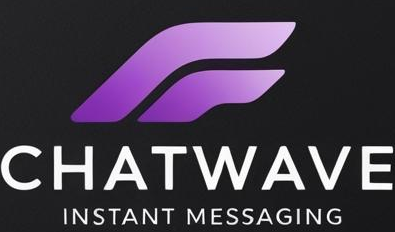

<p align="center">
  
</p>

## What is ChatWave?
Modern, Simple and Secure REST API for self-hosted messanger with open source code and GPLv3 license! This repository contains only the backend written on python 3.11 and FastAPI.

## Features
- Self-hosted backend
- Secure authorization (Bearer HS256), data transport (TLSv3), DB password hashing
- Account's profile managing
- Personal chats
- Group chats
- Media messages support, including voice
- Instant receipt of unread messages on WebSockets
- Complete (permanent) deletion of messages

## Future plans
- Develop a Web frontend for the application
- Add support for video messages (real-time)
- Add support for personal and group audio and video calls

## How to use this app?

At the moment, the frontend has not been created, so you can wait for the official release of the web application or help with this. To help in the development of the project, you can support the repository here:

- https://github.com/lifufkd/ChatWave
- https://hub.docker.com/repository/docker/sbrse/chatwave

## How to install this app?

1. **From source code**: 
```
git clone https://github.com/lifufkd/ChatWave
pip install -r requirements.txt
cd ./src
nano .env (Fill in the env file according to the section "ENV configuration")
uvicorn main:app --host 0.0.0.0 --port 8000
```
2. **Docker**: 
Read this instruction on [project docker](https://hub.docker.com/repository/docker/sbrse/chatwave) page

## ENV configuration

```
DB_HOST=<DOMAIN-OR-IP>
DB_PORT=<PORT>
DB_USER=<USER>
DB_PASSWORD=<PASSWORD>
DB_DATABASE=<DATABASE-NAME>
REDIS_HOST=<DOMAIN-OR-IP>
REDIS_PORT=<PORT>
MEDIA_FOLDER=/app/data
 
# Optionaly
DB_SCHEMA=chatwave
REDIS_DATABASE=0
JWT_SECRET_KEY=09d25e094faa6ca2556c818166b7a9563b93f7099f6f0f4caa6cf63b88e8d3e7 # 256 bit random string
JWT_ACCESS_TOKEN_EXPIRES=1209600 # Token expire time in seconds
JWT_ALGORITHM=HS256
CHUNK_SIZE=16 # Decimal value in MB for streaming video
MAX_UPLOAD_IMAGE_SIZE=30 # Decimal value in MB
MAX_UPLOAD_VIDEO_SIZE=8192 # Decimal value in MB
MAX_UPLOAD_AUDIO_SIZE=512 # Decimal value in MB
MAX_UPLOAD_FILE_SIZE=16384 # Decimal value in MB
MAX_ITEMS_PER_REQUEST=100 # Decimal value
```

## License
View [license information⁠](https://github.com/lifufkd/ChatWave/blob/main/LICENSE) for the software contained in this image.
